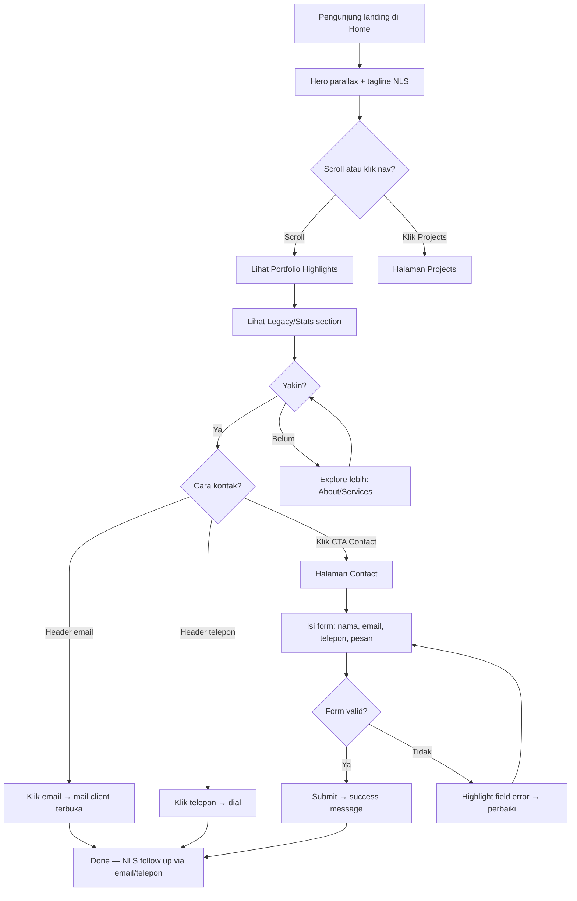
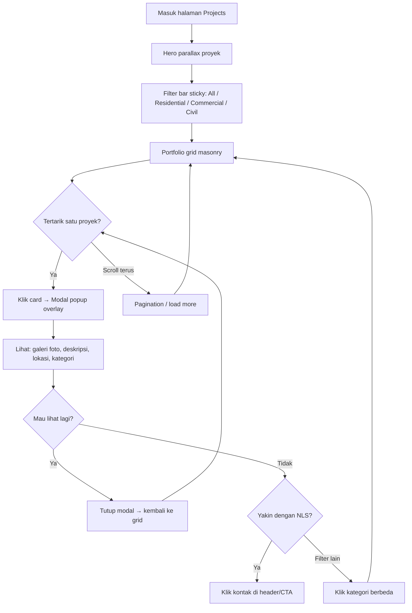
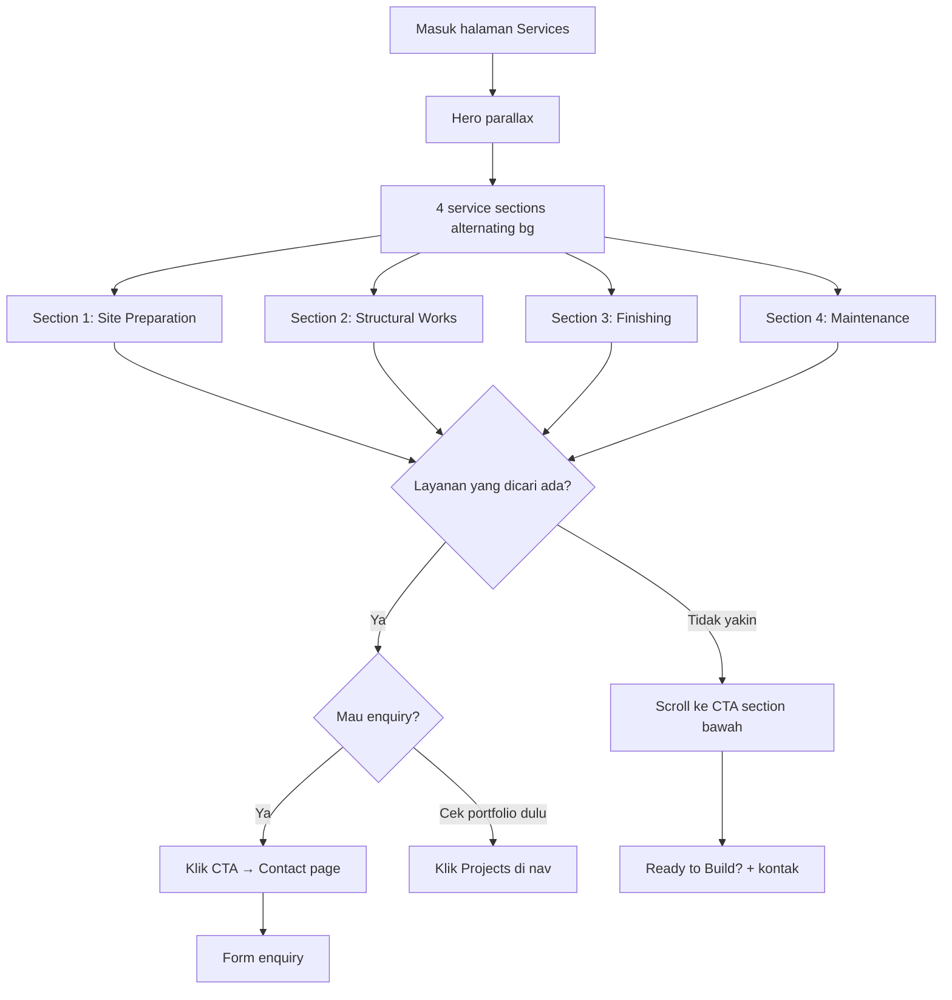

# UX Design Specification — NLS HITECH NIAGA

**Author:** LENOVO
**Date:** 2026-05-11

---

## Konteks Proyek

**Perusahaan:** NLS HITECH NIAGA (Petaling, Selangor)
**Jenis:** Website Kontraktor Konstruksi
**Registrasi:** CIDB G4
**Layanan:** Konstruksi end-to-end — persiapan lahan, pekerjaan struktural, finishing, dan maintenance terjadwal
**Segmen Pasar:** Residensial, komersial, dan proyek sipil ringan
**Nilai Utama:** Keselamatan kerja, komunikasi transparan, workmanship rapi

---

## Executive Summary

### Project Vision

Website korporat untuk **NLS HITECH NIAGA** — kontraktor CIDB G4 di Petaling, Selangor. Tujuan utama: **branding perusahaan** dan **menghasilkan enquiry** dari calon klien. Website berfungsi sebagai company profile digital yang profesional, menampilkan kapabilitas, portofolio proyek, dan menyediakan jalur kontak yang mudah.

- **Device:** Desktop-first, responsive untuk mobile/tablet
- **Bahasa:** Default English, dengan switching ke Bahasa Malaysia (bilingual)
- **Audience:** Malaysia

### Target Users

- **Pemilik rumah/properti** — ingin renovasi atau bangun rumah, cari kontraktor terpercaya
- **Pemilik bisnis/perusahaan** — butuh fit-out komersial atau maintenance terjadwal
- **Developer properti kecil-menengah** — cari kontraktor G4 untuk proyek sipil ringan
- **Profil umum:** Audience Malaysia, tingkat tech-savvy menengah, akses utama via desktop tapi juga mobile

### Key Design Challenges

- **Membangun trust secara visual** — industri konstruksi bergantung pada kepercayaan; desain harus memancarkan profesionalisme dan kredibilitas
- **Bilingual seamless** — switching English ↔ Bahasa Malaysia tanpa mengganggu UX flow
- **Desktop-first tapi responsive** — layout harus optimal di layar besar, tetap fungsional di mobile
- **Konversi enquiry** — CTA harus jelas dan mudah diakses dari setiap halaman

### Design Opportunities

- **Portofolio visual yang kuat** — foto proyek before/after bisa jadi pembeda besar vs kompetitor yang hanya teks
- **Trust signals** — badge CIDB G4, testimoni klien, angka proyek selesai — bisa ditonjolkan di hero section
- **Enquiry flow yang simpel** — form kontak/WhatsApp yang accessible dari mana saja, mengurangi friction

### Struktur Halaman

| Halaman | Fungsi |
|---------|--------|
| Home | Hero branding, highlight layanan, trust signals, CTA enquiry |
| About | Profil perusahaan, visi/misi, registrasi CIDB, tim |
| Services | Detail layanan end-to-end (site prep → struktural → finishing → maintenance) |
| Projects/Portfolio | Galeri proyek dengan kategori (residensial/komersial/sipil) |
| Contact | Form enquiry, lokasi, WhatsApp, info kontak |

## Core User Experience

### Defining Experience

Pengalaman inti website NLS HITECH NIAGA berpusat pada **membangun kepercayaan visual lalu mengkonversi ke enquiry**. Pengunjung harus merasa yakin dengan profesionalisme NLS dalam hitungan detik pertama, lalu dengan mudah menghubungi via email atau telepon office.

**Core Action:** Pengunjung melihat portofolio/kredensial → merasa yakin → mengirim enquiry (email/telepon)

**Kontak utama:**
- Email perusahaan
- Nomor telepon office
- Tersedia jelas di header/footer setiap halaman

### Platform Strategy

| Aspek | Keputusan |
|-------|-----------|
| Platform | Web — desktop-first, fully responsive |
| Interaksi | Mouse/keyboard utama, touch-friendly untuk mobile |
| Visual style | **Modern dengan efek parallax** — memberikan kesan premium dan profesional |
| Bahasa | Bilingual — English (default) + Bahasa Malaysia (toggle switch) |
| Offline | Tidak diperlukan |

### Effortless Interactions

- **Kontak selalu visible** — email & no. telpon office di header/footer, tidak perlu scroll atau cari
- **Navigasi simpel** — 5 halaman utama, tidak perlu dropdown berlapis
- **Parallax scrolling** — transisi antar section terasa smooth dan modern, bukan mengganggu
- **Language switch** — satu klik toggle, posisi konsisten, tidak reload halaman
- **Portofolio browsing** — filter kategori yang intuitif, gambar load cepat

### Critical Success Moments

1. **First impression (0-3 detik)** — Hero section dengan parallax, gambar proyek berkualitas tinggi, langsung terasa profesional dan modern
2. **Trust building (10-30 detik)** — Pengunjung melihat badge CIDB G4, angka proyek, testimoni — mulai percaya
3. **Decision point** — Setelah lihat portofolio, pengunjung yakin dan cari kontak — email/telepon harus langsung tersedia tanpa friction
4. **Enquiry action** — Satu klik ke email atau telepon, zero barrier

### Experience Principles

1. **Trust at First Sight** — Desain modern + parallax + portofolio visual = kredibilitas instan
2. **Zero-Friction Contact** — Email dan telepon selalu satu klik away dari mana saja
3. **Show, Don't Tell** — Foto proyek dan angka lebih meyakinkan dari paragraf teks
4. **Smooth & Premium** — Parallax dan animasi halus mencerminkan kualitas workmanship NLS

## Desired Emotional Response

### Primary Emotional Goals

- **Kagum (Awe)** — Pengunjung harus langsung terkesan: "Kontraktor ini pernah bangun Petronas Twin Towers." Efek parallax, visual megah, dan referensi proyek ikonik menciptakan rasa takjub.
- **Yakin (Confidence)** — Setelah kagum, pengunjung harus merasa: "Kalau mereka bisa handle Twin Towers, proyek saya pasti aman." Kepercayaan absolut terhadap kapabilitas NLS.

### Emotional Journey Mapping

| Tahap | Emosi Target | Trigger |
|-------|-------------|---------|
| Landing (0-3 detik) | **Kagum** | Hero parallax dengan visual Petronas Twin Towers / proyek besar, headline yang powerful |
| Explore (10-60 detik) | **Impressed** | Portofolio proyek, angka pengalaman, badge CIDB G4 |
| Deep dive | **Yakin & Percaya** | Detail layanan, testimoni, track record Twin Towers |
| Decision | **Mantap** | "Kontraktor ini proven — saya mau kerja sama" |
| Contact | **Mudah & Lega** | Email/telepon langsung tersedia, zero friction |

### Micro-Emotions

- **Confidence > Skepticism** — Track record Twin Towers langsung menghapus keraguan
- **Awe > Indifference** — Parallax + visual proyek ikonik mencegah kesan "kontraktor biasa"
- **Trust > Anxiety** — Registrasi CIDB G4 + proyek landmark = jaminan kualitas
- **Ease > Frustration** — Navigasi simpel, kontak selalu accessible

### Design Implications

| Emosi | Keputusan Desain |
|-------|-----------------|
| Kagum | Hero section besar dengan parallax, foto/referensi Petronas Twin Towers sebagai anchor visual utama |
| Yakin | Section "Legacy" atau "Our Iconic Work" — highlight kontribusi di Twin Towers secara prominent |
| Impressed | Counter animasi (tahun pengalaman, proyek selesai, dll) yang muncul saat scroll |
| Mudah | Kontak (email + telepon) sticky/visible di setiap viewport |

### Emotional Design Principles

1. **Lead with Legacy** — Petronas Twin Towers adalah aset emosional terbesar; tampilkan di momen pertama, bukan tersembunyi di halaman about
2. **Awe through Motion** — Parallax dan animasi halus memperkuat rasa kagum, bukan sekadar dekorasi
3. **Confidence through Proof** — Setiap section harus punya bukti nyata (foto, angka, sertifikasi), bukan klaim kosong
4. **Never Overwhelm** — Efek visual harus memperkuat konten, bukan mengalihkan — hindari animasi berlebihan yang menutupi pesan

## UX Pattern Analysis & Inspiration

### Inspiring Products Analysis

**1. Edifis (edifis.com) — Kontraktor Premium, Parallax Master**
- Cursor-reactive 3D model di hero — interaktif dan memorable
- **Parallax langit bergerak** di atas bangunan menciptakan kedalaman visual
- Video background untuk showcase expertise
- Thumbnail portofolio expand saat scroll
- Layout minimalis, fungsi diutamakan
- **Relevansi NLS:** Pendekatan parallax + minimalis bisa langsung diadopsi

**2. Gerding Builders (gerdingbuilders.com) — Statistik + Branding Kuat**
- Layout modern mirip desain arsitektur
- Hover effect yang reveal gambar di balik statistik/angka
- Warna branding konsisten (orange-black-white)
- Section testimonial dan berita
- **Relevansi NLS:** Pola statistik + hover cocok untuk menampilkan track record Twin Towers

**3. Woodhull (woodhull.com) — Profesional & Clean**
- Spacing lega, palet warna netral, fotografi berkualitas tinggi
- Toggle switch antara "Services" dan "Process"
- Potret monokrom tim untuk humanisasi
- Section "Press & Awards" highlight klien besar
- **Relevansi NLS:** Pendekatan clean + awards section cocok untuk CIDB badge dan legacy Twin Towers

**4. Nasatra Bina (nasatrabina.com) — Kontraktor Malaysia, CIDB Certified**
- Konteks lokal Malaysia, CIDB registered
- Showcase proyek custom build
- Navigasi sederhana, fokus portofolio
- **Relevansi NLS:** Referensi bagaimana kontraktor Malaysia tampil di digital

### Transferable UX Patterns

**Navigasi:**
- Sticky header transparan yang berubah solid saat scroll — menjaga akses navigasi tanpa mengganggu hero parallax
- Mega menu tidak diperlukan — 5 halaman cukup dengan nav bar simpel

**Interaksi:**
- Parallax scroll pada hero + section dividers — menciptakan kedalaman tanpa berlebihan (pola Edifis)
- Counter animasi angka saat masuk viewport — "25+ tahun", "500+ proyek" (pola Gerding)
- Hover reveal pada portofolio grid — thumbnail → detail proyek

**Visual:**
- Full-width hero image/video dengan overlay teks — kesan megah (pola Crosby)
- Palet warna gelap (dark navy/charcoal) + aksen emas/kuning — kesan premium & konstruksi
- Fotografi proyek berkualitas tinggi sebagai konten utama, bukan stock photo

**Trust:**
- Badge/sertifikasi (CIDB G4) di atas fold — langsung terlihat
- Section legacy/milestone dengan timeline visual — Twin Towers sebagai highlight

### Anti-Patterns to Avoid

- **Slider carousel otomatis** — pengguna jarang lihat slide ke-3+; lebih baik satu hero image kuat
- **Parallax berlebihan** — lebih dari 2-3 layer parallax per halaman membuat pusing dan lambat di mobile
- **Stock photo generik** — pekerja dengan helm di stock photo = langsung kehilangan trust; pakai foto proyek asli
- **Form kontak panjang** — lebih dari 4-5 field = drop-off tinggi; cukup nama, email/telepon, pesan
- **Animasi berat tanpa fallback** — pastikan reduced-motion preference dihormati, mobile tetap smooth

### Design Inspiration Strategy

**Adopt (Pakai Langsung):**
- Parallax hero section dengan gambar proyek ikonik (pola Edifis)
- Sticky transparent header (standar industri)
- Counter animasi untuk statistik perusahaan (pola Gerding)
- CIDB badge + trust signals di atas fold

**Adapt (Modifikasi):**
- Toggle services dari Woodhull → adaptasi jadi tab kategori di portofolio (residensial/komersial/sipil)
- Awards section dari Woodhull → jadi "Legacy" section khusus Twin Towers
- Hover reveal dari Gerding → untuk galeri proyek dengan detail overlay

**Avoid (Hindari):**
- Auto-rotating sliders — pakai static hero parallax
- Animasi berat yang lambat di koneksi Malaysia biasa
- Layout terlalu kompleks — tetap 5 halaman, navigasi datar

## Design System Foundation

### Design System Choice

**Tailwind CSS + Vanilla JS** — design system foundation untuk website NLS HITECH NIAGA.

Tanpa framework berat — pure HTML, Tailwind CSS untuk styling, dan JavaScript murni untuk interaksi (parallax, counter animasi, scroll effects, language toggle).

### Rationale for Selection

| Faktor | Keputusan |
|--------|-----------|
| Keunikan visual | Tailwind tidak memaksakan "look" tertentu — desain bisa 100% custom sesuai branding NLS |
| Parallax & animasi | Mudah diintegrasikan dengan library ringan (AOS, GSAP, atau custom scroll listener) |
| Performance | Tanpa framework overhead — website 5 halaman load sangat cepat |
| Development speed | Utility classes Tailwind mempercepat styling tanpa menulis CSS dari nol |
| Responsive | Built-in responsive utilities (`md:`, `lg:`, `xl:`) — desktop-first approach mudah |
| Maintenance | HTML + Tailwind + vanilla JS = minimal dependency, mudah di-maintain jangka panjang |
| Bilingual | Language toggle cukup dengan vanilla JS DOM manipulation, tanpa perlu i18n library besar |

### Implementation Approach

**Tech Stack:**
- **HTML5** — semantic markup, multi-page (bukan SPA)
- **Tailwind CSS v3+** — utility-first styling, custom theme config
- **Vanilla JavaScript** — interaksi, parallax, animasi, language switch
- **Library pendukung ringan:**
  - AOS (Animate on Scroll) atau GSAP ScrollTrigger — untuk parallax dan scroll animations
  - CountUp.js atau custom — untuk counter animasi statistik

**Arsitektur File:**
```
/
├── index.html          (Home)
├── about.html          (About)
├── services.html       (Services)
├── projects.html       (Projects/Portfolio)
├── contact.html        (Contact)
├── css/
│   └── output.css      (Tailwind compiled)
├── js/
│   ├── main.js         (navigasi, language toggle, shared)
│   ├── parallax.js     (parallax & scroll effects)
│   └── counter.js      (statistik counter animasi)
├── img/                (foto proyek, logo, assets)
└── lang/
    ├── en.json         (English strings)
    └── ms.json         (Bahasa Malaysia strings)
```

### Customization Strategy

**Tailwind Theme Config:**
- Warna custom: dark navy/charcoal (primary), gold/amber (accent), putih (text)
- Font: sans-serif modern (Inter/Poppins untuk heading, system-ui untuk body)
- Breakpoints: desktop-first (`lg:` sebagai base, override untuk `md:` dan `sm:`)
- Custom spacing/sizing untuk section parallax

**Komponen Custom yang Dibangun:**
- Hero parallax section dengan overlay
- Sticky transparent → solid header
- Portfolio grid dengan hover reveal + filter kategori
- Counter animasi section
- Language toggle component
- Contact section dengan email + telepon prominent

## 2. Core User Experience

### 2.1 Defining Experience

**"Lihat bukti kerja → yakin → hubungi"**

Website NLS HITECH NIAGA bukan alat akuisisi pertama — calon klien sudah dengar tentang NLS dari referensi/kenalan. Website berfungsi sebagai **alat validasi**: pengunjung datang untuk membuktikan bahwa NLS memang sebaik yang diceritakan.

Defining experience: **Pengunjung scroll portofolio proyek terbaru, kagum dengan kualitas kerja, lalu dengan percaya diri menghubungi NLS.**

Analogi: Seperti Tinder-nya kontraktor — "Swipe portofolio, match dengan kontraktor yang tepat." Bedanya, di sini pengunjung sudah setengah yakin dari referensi, website tinggal mengkonfirmasi.

### 2.2 User Mental Model

**Bagaimana pengunjung berpikir:**
1. Dapat rekomendasi NLS dari kenalan/kolega
2. Buka website untuk cek: "Betul ke ni kontraktor bagus?"
3. Lihat portofolio — "Wah, mereka pernah buat proyek macam ni"
4. Lihat Twin Towers legacy — "Confirmed, mereka memang proven"
5. Cari kontak — telepon atau email langsung

**Ekspektasi pengunjung:**
- Website harus terlihat **seprofesional** hasil kerja NLS
- Portofolio harus mudah dilihat, bukan tersembunyi
- Info kontak harus langsung ketemu, bukan klik 3x
- Website lambat atau murahan = keraguan langsung muncul

**Frustrasi dengan website kontraktor lain:**
- Banyak teks, sedikit gambar proyek
- Portofolio outdated atau tidak ada
- Susah cari nomor telepon
- Desain terlihat murah — tidak match dengan klaim "premium"

### 2.3 Success Criteria

| Kriteria | Indikator Sukses |
|----------|-----------------|
| Validasi cepat | Dalam 10 detik, pengunjung sudah lihat portofolio proyek terbaru |
| Trust confirmed | Pengunjung menemukan Twin Towers legacy + CIDB G4 badge tanpa harus cari |
| Kontak mudah | Email/telepon bisa diakses dari halaman manapun dalam 1 klik |
| Visual match | Kualitas website = kualitas kerja yang diklaim — desain modern, parallax smooth |
| Zero confusion | Pengunjung tidak perlu berpikir "ini di mana ya?" — navigasi intuitif |

### 2.4 Novel UX Patterns

**Pendekatan: Established patterns dengan eksekusi premium**

Website ini tidak butuh pola baru — pengunjung sudah familiar dengan website korporat. Yang membedakan adalah **kualitas eksekusi**:

**Established patterns yang diadopsi:**
- Sticky header + navigasi horizontal — standar industri
- Hero section full-width — ekspektasi website modern
- Grid portofolio dengan filter — pola familiar galeri
- Footer dengan info kontak — konvensi universal

**Twist unik NLS:**
- Parallax pada hero + section dividers — elevasi visual di atas kontraktor lain
- Legacy section Twin Towers — elemen trust yang tidak dimiliki kompetitor
- Counter animasi statistik — bukti nyata, bukan klaim kosong
- Portofolio sebagai landing focus — bukan services, bukan about, tapi bukti kerja dulu

### 2.5 Experience Mechanics

**Flow utama pengunjung:**

```
LANDING (Home)
│
├─ 1. HERO PARALLAX
│     Portofolio proyek terbaru, full-width
│     Headline: tagline NLS
│     Sub: "CIDB G4 Registered Contractor"
│     ↓ scroll
│
├─ 2. PORTFOLIO HIGHLIGHTS
│     3-4 proyek terbaru dalam grid
│     Hover → detail overlay
│     CTA: "View All Projects"
│     ↓ scroll
│
├─ 3. LEGACY / TRUST SECTION
│     Twin Towers reference + counter animasi
│     (tahun pengalaman, proyek selesai, dll)
│     ↓ scroll
│
├─ 4. SERVICES OVERVIEW
│     4 layanan utama dalam cards
│     Icon + judul + 1 kalimat
│     CTA: "Learn More" per service
│     ↓ scroll
│
├─ 5. CONTACT CTA
│     "Ready to Build?" + email & telepon prominent
│     ↓
│
└─ FOOTER
      Kontak lengkap, nav links, language toggle
```

**Feedback loops:**
- Parallax smooth saat scroll → "website ini premium"
- Counter animasi saat masuk viewport → "angka-angka ini impresif"
- Hover effect di portofolio → "ada detail lebih, saya mau lihat"
- Kontak selalu visible di header → "kapanpun saya siap, tinggal klik"

## Visual Design Foundation

### Color System

**Palet Utama — Steel & Blue (Modern Industrial)**

| Token | Warna | Hex | Penggunaan |
|-------|-------|-----|-----------|
| `primary-900` | Steel Dark | `#0f172a` | Background hero, header scroll state |
| `primary-800` | Slate | `#1e293b` | Background section gelap, footer |
| `primary-700` | Steel Gray | `#374151` | Card backgrounds, overlay |
| `primary-100` | Light Gray | `#f1f5f9` | Background section terang |
| `primary-50` | Off White | `#f8fafc` | Background utama |
| `accent-600` | Electric Blue | `#2563eb` | CTA buttons, links, hover states |
| `accent-500` | Blue | `#3b82f6` | Secondary accents, icons aktif |
| `accent-400` | Light Blue | `#60a5fa` | Hover states, subtle highlights |
| `white` | Pure White | `#ffffff` | Teks di dark background |
| `text-900` | Near Black | `#0f172a` | Body text di light background |
| `text-500` | Medium Gray | `#64748b` | Secondary text, captions |
| `success` | Green | `#16a34a` | Form validation sukses |
| `error` | Red | `#dc2626` | Form validation error |

**Contrast Ratios (WCAG AA):**
- White text on `primary-900`: 15.4:1 ✅
- White text on `accent-600`: 4.6:1 ✅
- `text-900` on `primary-50`: 17.4:1 ✅

### Typography System

**Font Pairing — Elegant & Clean:**

| Role | Font | Weight | Fallback |
|------|------|--------|----------|
| Heading | **Inter** | 600 (semibold), 700 (bold) | system-ui, sans-serif |
| Body | **Inter** | 400 (regular), 500 (medium) | system-ui, sans-serif |
| Accent/Label | **Inter** | 500 (medium), uppercase tracking | system-ui, sans-serif |

Inter sebagai single font family — clean, profesional, excellent readability di semua ukuran. Satu font = konsisten, fast loading.

**Type Scale (Desktop-first):**

| Level | Size | Weight | Line Height | Penggunaan |
|-------|------|--------|-------------|-----------|
| Display | 64px / 4rem | 700 | 1.1 | Hero headline |
| H1 | 48px / 3rem | 700 | 1.2 | Page titles |
| H2 | 36px / 2.25rem | 600 | 1.25 | Section headings |
| H3 | 24px / 1.5rem | 600 | 1.3 | Sub-section headings |
| H4 | 20px / 1.25rem | 600 | 1.4 | Card titles |
| Body | 16px / 1rem | 400 | 1.6 | Paragraf utama |
| Body SM | 14px / 0.875rem | 400 | 1.5 | Secondary text, captions |
| Label | 12px / 0.75rem | 500 | 1.4 | Tags, badges, uppercase labels |

**Responsive Scale:**
- Mobile: Display → 40px, H1 → 32px, H2 → 28px
- Tablet: Display → 52px, H1 → 40px, H2 → 32px

### Spacing & Layout Foundation

**Base Unit: 4px**

| Token | Value | Penggunaan |
|-------|-------|-----------|
| `space-1` | 4px | Micro gaps (icon-text) |
| `space-2` | 8px | Tight spacing (inline elements) |
| `space-3` | 12px | Compact spacing (list items) |
| `space-4` | 16px | Default gap (card padding, form fields) |
| `space-6` | 24px | Medium spacing (between cards) |
| `space-8` | 32px | Section internal padding |
| `space-12` | 48px | Between content blocks |
| `space-16` | 64px | Section padding (mobile) |
| `space-24` | 96px | Section padding (desktop) |
| `space-32` | 128px | Hero section padding |

**Layout Grid:**
- Max width: `1280px` (container)
- Kolom: 12-column grid
- Gutter: `24px` (desktop), `16px` (mobile)
- Side padding: `64px` (desktop), `24px` (tablet), `16px` (mobile)

**Layout Principles:**
- **Spacious & breathing** — section padding besar (`96px+`) untuk kesan premium
- **Asimetri terkontrol** — parallax layers menciptakan kedalaman, bukan chaos
- **Visual hierarchy jelas** — spacing lebih besar = lebih penting

### Accessibility Considerations

- Semua teks memenuhi **WCAG 2.1 AA** minimum contrast ratio (4.5:1 body, 3:1 large text)
- Font size minimum 16px untuk body text — readable tanpa zoom
- Focus states visible dengan outline `accent-600` pada semua interactive elements
- `prefers-reduced-motion` media query — disable parallax dan animasi untuk pengguna yang sensitif
- Touch target minimum 44x44px pada mobile
- Language toggle accessible via keyboard (Tab + Enter)

## Design Direction Decision

### Design Directions Explored

6 arah desain dieksplorasi melalui HTML mockup interaktif (`ux-design-directions.html`):

| Direction | Konsep | Evaluasi |
|-----------|--------|----------|
| **A: Cinematic Parallax** ✅ | Full-screen hero parallax, dark palette dominan | **Dipilih** — visual impact maksimal, balance antara megah dan fungsional |
| B: Split Layout | Hero terbagi dua, modern terstruktur | Terlalu korporat standar, kurang wow factor |
| C: Brutalist | Tipografi raksasa, minimal ornamen | Terlalu berani untuk audience kontraktor Malaysia |
| D: Light Card | Background terang, card-based | Terlalu ringan, tidak match dengan kesan premium konstruksi |
| E: Full-bleed | Visual bangunan dominan | Bagus untuk legacy tapi kurang fleksibel untuk halaman lain |
| F: Timeline | Storytelling chronological | Menarik untuk about page, tapi bukan sebagai direction utama |

### Chosen Direction

**Direction A: Cinematic Parallax** — full-screen hero dengan parallax depth, dark palette dominan (Steel & Blue), setiap section terasa sinematik dan premium.

**Elemen kunci:**
- Hero full-viewport dengan parallax background + overlay teks besar
- Dark palette (`#0f172a` / `#1e293b`) sebagai tone utama seluruh website
- Portofolio grid dengan hover reveal overlay
- Stats/legacy section dengan counter animasi
- Service cards dengan hover glow effect (border `accent-600`)
- CTA section dengan gradient background
- Sticky transparent header → solid on scroll
- Footer comprehensive dengan language toggle

### Design Rationale

1. **Match dengan emotional goal** — kesan kagum (awe) paling kuat dicapai lewat full-screen cinematic approach
2. **Parallax natural** — direction ini paling cocok untuk implementasi parallax tanpa terasa dipaksakan
3. **Dark palette = premium** — industri konstruksi premium secara universal menggunakan dark tones
4. **Portofolio sebagai hero** — sesuai defining experience: validasi lewat bukti kerja visual
5. **Scalable** — pattern ini bisa konsisten diterapkan di semua 5 halaman

### Implementation Approach

**Per halaman:**

| Halaman | Layout Approach |
|---------|----------------|
| Home | Hero parallax full → portfolio grid → stats/legacy → services cards → CTA → footer |
| About | Hero parallax (company) → visi/misi → Twin Towers legacy timeline → tim → CTA |
| Services | Hero parallax (project) → 4 service detail sections dengan alternating dark/slate bg |
| Projects | Hero parallax → filter bar (sticky) → portfolio grid masonry → pagination |
| Contact | Hero parallax (kantor) → split: form kiri + info kontak kanan → map embed → footer |

**Konsistensi antar halaman:**
- Setiap halaman mulai dengan hero parallax (gambar berbeda, pattern sama)
- Section alternating: `section-dark` ↔ `section-slate` untuk ritme visual
- CTA section sebelum footer di setiap halaman
- Header dan footer identik di semua halaman

## User Journey Flows

### Journey 1: Validasi & Enquiry (Primary)

**Konteks:** Pengunjung dapat rekomendasi NLS dari kenalan, buka website untuk validasi, lalu hubungi.



**Durasi target:** Landing → enquiry dalam **< 2 menit**

**Touchpoints kontak (selalu tersedia):**
- Header: email + telepon (setiap halaman)
- CTA section: "Ready to Build?" (setiap halaman)
- Contact page: form enquiry lengkap

### Journey 2: Browse Portfolio

**Konteks:** Pengunjung ingin lihat bukti kerja NLS sebelum memutuskan.



**Detail modal popup:**
- Galeri foto (swipe/arrow navigation)
- Nama proyek + lokasi
- Kategori tag (Residential/Commercial/Civil)
- Deskripsi singkat (2-3 kalimat)
- Tombol close (X) + klik outside = tutup
- Keyboard: ESC = tutup

### Journey 3: Cek Layanan

**Konteks:** Pengunjung mau tahu apakah NLS bisa handle jenis proyek mereka.



**Tiap service section berisi:**
- Icon + judul layanan
- Deskripsi 2-3 paragraf
- Bullet points scope pekerjaan
- Foto contoh proyek terkait

### Journey Patterns

**Navigation patterns:**
- **Persistent header** — logo, nav links, email, telepon, language toggle selalu visible
- **Scroll-to-section** — smooth scroll saat klik anchor di halaman yang sama
- **Cross-page CTA** — setiap halaman punya CTA section yang mengarah ke Contact

**Feedback patterns:**
- **Form validation** — inline real-time (border merah + pesan error di bawah field)
- **Submit success** — replace form dengan success message + konfirmasi "We'll contact you within 24 hours"
- **Modal interaction** — fade in overlay, body scroll lock, close via X/ESC/outside click
- **Hover states** — portfolio cards scale 1.05 + overlay appear, service cards border glow

**Language switch pattern:**
- Toggle EN/BM di header (kanan)
- Satu klik switch — DOM text replacement via JSON (`lang/en.json`, `lang/ms.json`)
- Preference disimpan di `localStorage`
- Tidak reload halaman

### Flow Optimization Principles

1. **Max 3 klik ke enquiry** — dari halaman manapun, pengunjung bisa reach kontak dalam ≤ 3 interaksi
2. **Progressive disclosure** — Home menampilkan highlights, detail ada di halaman masing-masing
3. **Multiple enquiry channels** — email di header (1 klik), telepon di header (1 klik), form di Contact (4 fields)
4. **No dead ends** — setiap section/halaman punya CTA atau navigasi jelas ke langkah berikutnya
5. **Mobile: tap-to-call** — nomor telepon otomatis jadi `tel:` link di mobile

## Component Strategy

### Design System Components

**Dari Tailwind CSS (tersedia langsung):**

| Komponen | Tailwind Utility | Penggunaan |
|----------|-----------------|-----------|
| Grid layout | `grid`, `grid-cols-*` | Portfolio grid, services grid, footer |
| Flexbox | `flex`, `gap-*` | Header nav, stats row, CTA contacts |
| Responsive | `lg:`, `md:`, `sm:` | Desktop-first breakpoints |
| Typography | `text-*`, `font-*`, `tracking-*` | Semua type scale |
| Colors | Custom theme tokens | Semua warna brand |
| Spacing | `p-*`, `m-*`, `gap-*` | Semua spacing tokens |
| Transitions | `transition-*`, `duration-*` | Hover effects, state changes |
| Container | `max-w-screen-xl`, `mx-auto` | Page container 1280px |

**Tidak tersedia — perlu custom:**
- Parallax scroll effect
- Counter animasi
- Portfolio modal popup
- Language toggle + i18n
- Sticky header state transition
- Form validation feedback

### Custom Components

**1. Hero Parallax Section**

| Aspek | Spesifikasi |
|-------|------------|
| **Purpose** | First impression — visual impact + tagline |
| **Anatomy** | Background image (fixed) + overlay gradient + content layer (teks, badge, CTA) |
| **States** | Default, scrolling (parallax offset berubah) |
| **Variants** | Home (full height 100vh), Inner pages (60vh) |
| **Behavior** | Background scroll speed 0.5x dari content — CSS `background-attachment: fixed` atau JS transform |
| **Accessibility** | `prefers-reduced-motion`: disable parallax, tampilkan static image |
| **Mobile** | Disable parallax (performance), gunakan static bg dengan overlay |

**2. Sticky Header**

| Aspek | Spesifikasi |
|-------|------------|
| **Purpose** | Navigasi + kontak selalu accessible |
| **Anatomy** | Logo | Nav links | Email + Telepon | Language toggle |
| **States** | Transparent (top) → Solid dark bg + shadow (scroll > 80px) |
| **Behavior** | `position: fixed`, background transition 0.3s on scroll |
| **Responsive** | Desktop: full nav | Mobile: hamburger menu + slide drawer |
| **Accessibility** | Keyboard navigable, `aria-expanded` pada mobile menu |

**3. Portfolio Card + Modal**

| Aspek | Spesifikasi |
|-------|------------|
| **Purpose** | Showcase proyek + detail view |
| **Card Anatomy** | Background image + gradient overlay + category tag + title + subtitle |
| **Card States** | Default, hover (scale 1.05 + overlay lighten), focus (outline) |
| **Modal Anatomy** | Backdrop overlay + container: galeri foto (left/right arrows) + info (nama, lokasi, kategori, deskripsi) + close button |
| **Modal States** | Opening (fade in 0.3s), open, closing (fade out 0.2s) |
| **Behavior** | Klik card → modal open, body scroll lock. Close: X button, ESC key, klik backdrop |
| **Accessibility** | Focus trap dalam modal, `aria-modal="true"`, `role="dialog"` |

**4. Stats Counter**

| Aspek | Spesifikasi |
|-------|------------|
| **Purpose** | Trust building — angka pengalaman dan pencapaian |
| **Anatomy** | Number (animated) + label |
| **States** | Idle (belum visible), animating (counting up), complete (final number) |
| **Behavior** | Trigger saat masuk viewport (IntersectionObserver). Count dari 0 ke target dalam 2 detik. Easing: ease-out |
| **Variants** | Number only ("500+"), text ("G4"), icon + number |
| **Accessibility** | `aria-label` dengan final value, `prefers-reduced-motion`: tampilkan angka langsung tanpa animasi |

**5. Service Card**

| Aspek | Spesifikasi |
|-------|------------|
| **Purpose** | Ringkasan layanan dengan CTA |
| **Anatomy** | Icon (48x48) + title + description (2 baris) |
| **States** | Default (border subtle), hover (border `accent-600` + glow shadow) |
| **Variants** | Dark bg (`service-card-dark`), light bg (`service-card-light`) |

**6. Language Toggle**

| Aspek | Spesifikasi |
|-------|------------|
| **Purpose** | Switch English ↔ Bahasa Malaysia |
| **Anatomy** | Pill toggle: [EN] [BM], active state highlighted |
| **Behavior** | Klik → load JSON (`lang/en.json` atau `lang/ms.json`) → replace semua `[data-i18n]` text nodes. Simpan preference ke `localStorage` |
| **States** | EN active (default), BM active |
| **Accessibility** | `role="radiogroup"`, `aria-checked`, keyboard navigable |

**7. Contact Form**

| Aspek | Spesifikasi |
|-------|------------|
| **Purpose** | Enquiry submission |
| **Anatomy** | 4 fields: nama (text), email (email), telepon (tel), pesan (textarea) + submit button |
| **States** | Empty, filling, valid, error (per field), submitting (button loading), success (form replaced), error (retry message) |
| **Validation** | Inline real-time: required check, email format, min length pesan (10 chars) |
| **Success** | Form fade out → success message: "Thank you! We'll contact you within 24 hours." |
| **Accessibility** | `aria-required`, `aria-invalid`, `aria-describedby` untuk error messages, form `role="form"` |

**8. CTA Section**

| Aspek | Spesifikasi |
|-------|------------|
| **Purpose** | Conversion point sebelum footer |
| **Anatomy** | Heading + subtext + primary button + email & telepon info |
| **Background** | Gradient (`primary-800` → `primary-900`) |
| **Variants** | Sama di semua halaman untuk konsistensi |

### Component Implementation Strategy

**Build order berdasarkan dependency:**

```
Phase 1 — Foundation (Week 1)
├── Sticky Header (dipakai semua halaman)
├── Hero Parallax Section (dipakai semua halaman)
├── CTA Section (dipakai semua halaman)
├── Footer (dipakai semua halaman)
└── Language Toggle (embedded di header + footer)

Phase 2 — Core Features (Week 2)
├── Portfolio Card (Projects page + Home highlights)
├── Portfolio Modal (Projects page)
├── Stats Counter (Home + About)
└── Service Card (Services page + Home)

Phase 3 — Conversion (Week 3)
├── Contact Form + validation
├── Mobile hamburger menu + drawer
└── Polish: scroll animations (AOS), hover refinements
```

### Implementation Roadmap

| Phase | Komponen | Halaman yang unblock |
|-------|----------|---------------------|
| 1 | Header, Hero, CTA, Footer, Lang Toggle | Semua halaman skeleton ready |
| 2 | Portfolio Card/Modal, Stats, Service Card | Home, Projects, Services functional |
| 3 | Contact Form, Mobile menu, Animations | Contact functional, mobile ready, polish |

**Total estimasi:** 3 minggu development untuk semua komponen + 5 halaman
